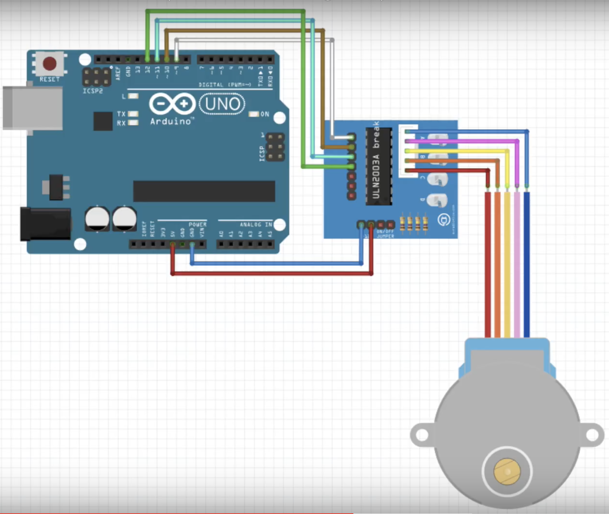
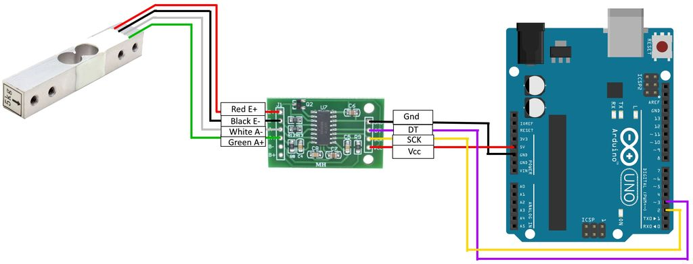

# Pet Feeder - Developer Documentation

# Features:
* Weight sensor to show food bowl fill level
* Stepper motor that activates food dispenser

# Set Up:
* Wire up HX711AD weight sensor to particle photon

The code uses A0 - SCK, A1 - DT for the wiring of weight sensor
* Wire up stepper motor and driver to particle photon

The code uses digital pins 1-4 for the wiring of weight scale
* Connect stepper motor to food dispenser contraption
* Copy HX711AD and Stepper motor libraries are included in Project
* Ensure Cordova interface included in project ui folder

# Possible modifications:
* Food dispenser could be connected to a fundamental structure to hold it up
* Use a stronger stepper motor for better dispensing (possibly a NEMA Bipolar Stepper Motor)
* Included a LIDAR range detector to check when the container is empty
* Add a button on the hardware to activate feeder 

# How to Modify:
* To incorporate additional devices, hardware code can be found in lib/PetHardware/src
* To change hardware to cloud features, the ino file is found in the src/ folder.
* To modify UI, javascript, css or html, it's included in ui/www folder.
