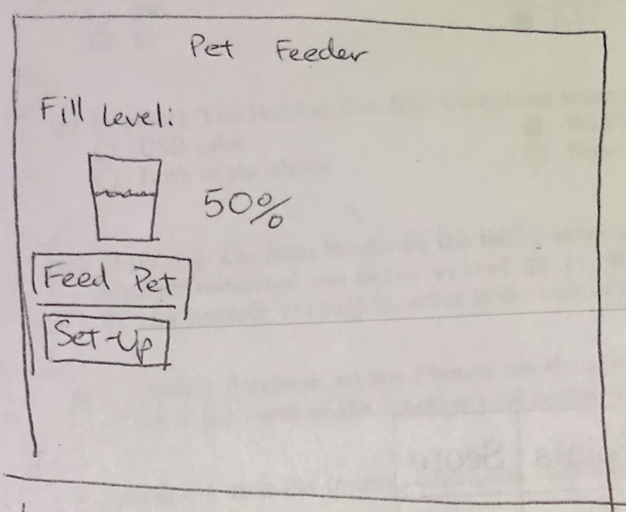
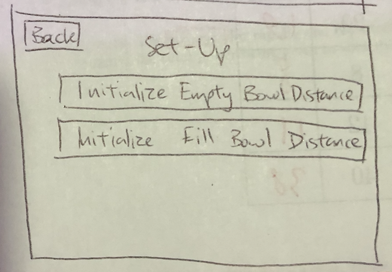
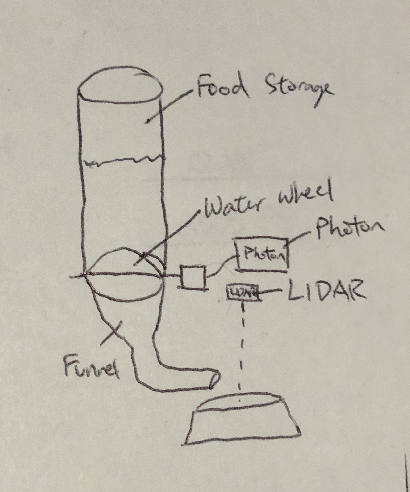
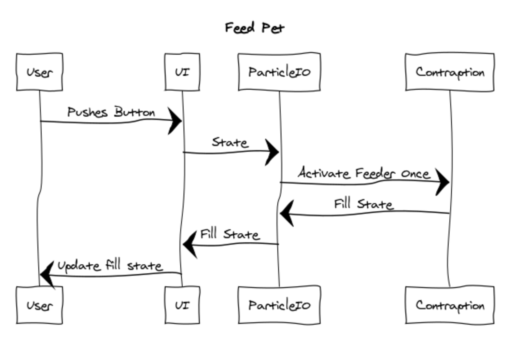
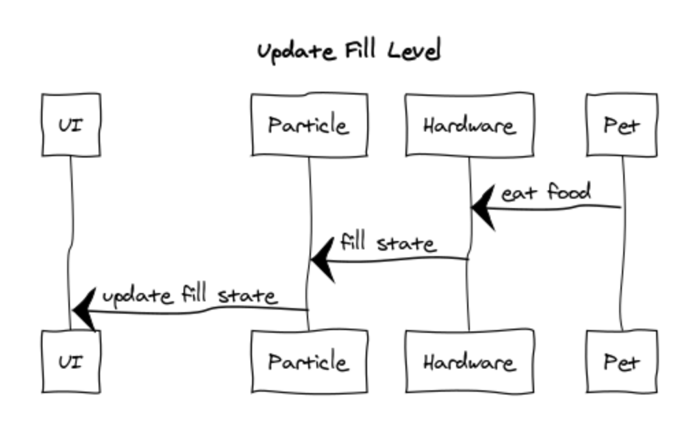

# 1. Description
As an owner of a cat and two dogs, I've found it very inconvenient occasionally when I've had to return home to feed my pets. Doing so has cost me a lot of time and money spent on the trips home and back out. It is just very costly to come all the way home to simply pour a bowl of food for your pet. Furthermore, there have been many situations where I've been unable to return until very late, way past their usual meal times. Consequently this places my pets in a stressful environment and would negatively affect their wellbeing. I want to create a pet feeder that is connected to the internet so you can pour dry food for your pet outside of home. This will be done by creating a mechanical pet feeder, consisting of a large plastic cylinder for the food, a water wheel connected to a servo motor to dispense the food, and a small funnel to direct the food into the bowl. The servo motor will be connected to a particle photon which will be able to connect the mechanical device to the internet. The particle photon will also be connected to a laser range sensor, which will be able to show the user the fill level of the bowl. Then there will also be a UI component where the users are able to see the fill level of the bowl and activate the feeder.
I expect this device to be beneficial to all pet owners. We all have unpredictable schedules and it's not always convenient for us to return home to feed our pets at a specific time period. It's incredibly valuable because it saves us two of our most important resources, time and money. By being able to feed your pets from anywhere you are, we can maintain the health of our pets without affecting our daily lives. Though the cost of the product is roughly $100 USD, it will save its users so much more in the long run in traveling costs and unmeasurable costs of time. 

# 2. Hardware and Cloud Infrastructure Needed
## Hardware: 
1. Time Of Flight Laser Ranging Sensor https://www.amazon.com/Gowoops-VL53L0X-Breakout-GY-VL53L0XV2-Distance/dp/B07F3RH7TC/ref=sr_1_1_sspa?crid=2CLY7I6A1QVL6&keywords=time+of+flight+sensor&qid=1573273787&sprefix=time+of+flight+sensor%2Caps%2C157&sr=8-1-spons&psc=1&spLa=ZW5jcnlwdGVkUXVhbGlmaWVyPUEzSkJNREZKV0NaSTJQJmVuY3J5cHRlZElkPUEwMjA1MDQxMTc5T0NFTldKWFVPSiZlbmNyeXB0ZWRBZElkPUEwMTA3MzY2Mk1GMzJTSkZLTkg0OCZ3aWRnZXROYW1lPXNwX2F0ZiZhY3Rpb249Y2xpY2tSZWRpcmVjdCZkb05vdExvZ0NsaWNrPXRydWU=
2. Servo Motor
3. Water Wheel - Will be 3D printed at STS
4. Clear cylinder container
5. Funnel Tube
6. Pet food bowl

## Cloud Infrastructure:
1. Particle Photon

# 3. Unknowns and Challenges
I'm not sure if the servo motor will be strong enough to spin the wheel with the weight of the pet food in the container. If not I'll have to use a stepper motor that is strong enough to spin it. I don't need something that is accurate, just powerful. I'm also unsure of the accuracy of the LIDAR Sensor I'll be using. I must figure out how to put it on a fixed level above the pet bowl. If it doesn't create accurate results, I will instead by using a weight scale to determine the fill level. 

# 4. User Stories & Usage Scenarios
As a pet owner, I want to feed my pet remotely, so I don't have to return home to do it.
As a pet, I want to be able to eat when it's meal time, so I don't feel hungry and stressed.
As a pet owner, I want to be able to see if my pet's bowl is empty, so I can know if I need to feed it.

# 5. Paper Prototypes

UI Main Page

UI Setup Page - Where the users can initialize there empty bowl and filled bowl levels to provide accurate fill level readings

Hardware Prototype Drawing
# 6. Implementation: Sequence Diagrams

Feed Pet Sequence Diagram

Update Fill State Sequence Diagram

# 7. Plan and Schedule

## Weekly Schedule / Progress

| Week End     | Deliverables & Accomplishments |
|:-------------|:-------------------------------|
| By Nov 16    |  UI Structure (Navigation and CSS) finished, Hardware delivered and wired |
| By Nov. 23   |  Pet Feeding Mechanism Built and tested |
| By Nov. 30   |  Cloud Capabilities Incorporated  |
| Dec. 3       |  Complete Project Due!         |

## Times Reserved for Project Work

Fill in a schedule of times reserved for the project.  If you can't set regular weekly times, create a schedule based on specific days.

| Week Day | Times | Who (if on a team) |
|:---------|:------|--------------------|
| Monday   |       |                    |
| Tuesday  |  1-3pm     |                    |
| Wednesday|       |                    |
| Thursday |  1-3pm     |                    |
| Friday   |  1-3pm     |                    |
| Saturday |       |                    |
| Sunday   |  4-6pm     |                    |

# 9. Bonus Credit
I will be physically creating a the pet feeding contraption, using a plastic cylinder for food storage, a 3D printed rotating wheel, and a funnel tube to direct the food into the bowl.
I will also be using an additional laser ranging sensor to determine the fill level of the bowl.
